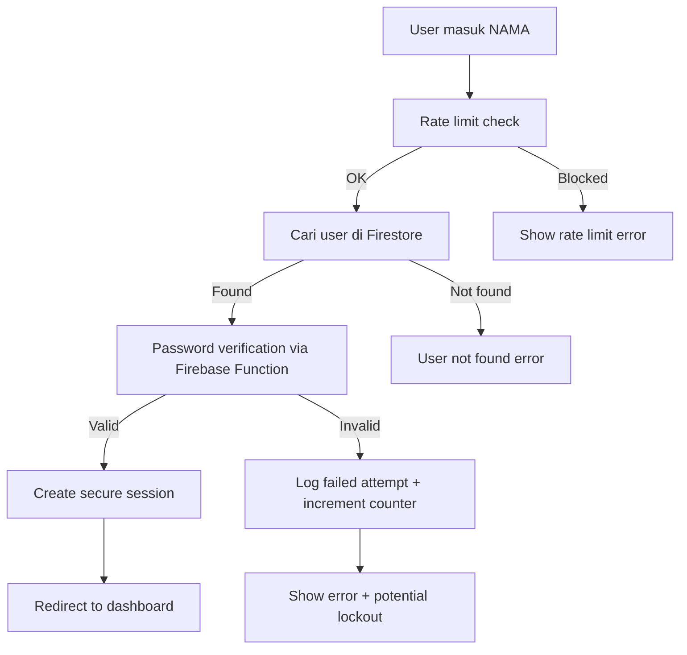

# 🔐 AUTHENTICATION APPROACH COMPARISON
**MyRajawali: Custom Auth vs Full Firebase Auth**

## 🤔 **CURRENT SITUATION**

**Saat ini MyRajawali menggunakan CUSTOM AUTHENTICATION:**
- 👤 Login dengan **NAMA JEMAAT** (bukan email)
- 🗃️ Data tersimpan di **Firestore collection 'jemaat'**
- 🔑 Password di-hash dengan **SHA256** (basic)
- 🚪 Session management **manual** via localStorage

---

## 🎯 **IMPLEMENTASI YANG SAYA BUAT: ENHANCED CUSTOM AUTH**

### **❓ Apakah ini Full Firebase Auth? TIDAK!**

**Yang saya implementasikan adalah ENHANCED CUSTOM AUTH dengan Firebase security features:**

### **✅ Tetap Menggunakan:**
- 👤 **Login dengan NAMA** (tidak berubah)
- 🗃️ **Firestore collection 'jemaat'** sebagai user database
- 🎯 **Custom authentication logic** 
- 📱 **Existing user experience** (familiar untuk jemaat)

### **🔥 Yang Ditingkatkan:**
- 🔐 **Password security:** SHA256 → **bcrypt** (via Firebase Functions)
- 🛡️ **Rate limiting:** Mencegah brute force attacks
- ⚡ **Session management:** Auto-logout dengan warning
- 📊 **Security monitoring:** Complete audit trail
- 🚪 **Advanced route guards:** Role-based access control
- 🗃️ **Database security:** Enhanced Firestore rules

---

## 🆚 **COMPARISON: CURRENT vs ENHANCED vs FULL FIREBASE**

| **Feature** | **Current (Existing)** | **Enhanced Custom (Implemented)** | **Full Firebase Auth** |
|-------------|------------------------|-----------------------------------|------------------------|
| **Login Method** | Nama jemaat | 👤 **Nama jemaat** (sama) | Email + password |
| **Password Security** | SHA256 (weak) | 🔐 **bcrypt** (enterprise) | Firebase secure |
| **User Experience** | Familiar | 👍 **Sama familiar** | Butuh training |
| **Rate Limiting** | None | ✅ **Multi-layer** | Built-in |
| **Session Security** | Basic localStorage | 🛡️ **Advanced management** | Firebase managed |
| **Monitoring** | None | 📊 **Complete logging** | Firebase Analytics |
| **Database Security** | Basic | 🔒 **Enhanced rules** | Built-in |
| **Implementation Effort** | - | 🟡 **Medium** | 🔴 **High** |
| **User Disruption** | - | 🟢 **Minimal** | 🔴 **Significant** |

---

## 🎯 **DETAILED EXPLANATION: ENHANCED CUSTOM AUTH**

### **🔄 Flow Login Yang Ditingkatkan:**



### **🔐 Password Security Enhancement:**

```javascript
// LAMA (existing):
const hashedPassword = CryptoJS.SHA256(password).toString()

// BARU (enhanced):
// Password di-hash dengan Firebase Function menggunakan bcrypt
const result = await hashPasswordFunction({ password })
const hashedPassword = result.data.hashedPassword // bcrypt hash
```

### **🛡️ Rate Limiting Implementation:**

```javascript
// Check rate limiting sebelum login
const rateLimitResult = checkRateLimit(`login_${nama}`)
if (!rateLimitResult.allowed) {
  throw new Error(`Terlalu banyak percobaan. Coba lagi dalam ${rateLimitResult.retryAfter}`)
}
```

### **⚡ Session Management:**

```javascript
// Session dengan auto-expiry dan warning
const sessionData = {
  userId: userDoc.id,
  nama: userData.nama,
  role: userData.role,
  loginTime: Date.now(),
  expiresAt: Date.now() + (24 * 60 * 60 * 1000), // 24 jam
  lastActivity: Date.now()
}

// Auto-logout warning 5 menit sebelum expired
// Session activity tracking untuk extend otomatis
```

---

## 🎯 **MENGAPA PILIH ENHANCED CUSTOM AUTH?**

### **✅ Advantages:**

1. **User Familiarity:**
   - Jemaat sudah terbiasa login dengan nama
   - Tidak perlu training atau adaptasi
   - Zero disruption ke workflow existing

2. **Data Continuity:**
   - Semua data jemaat tetap intact
   - Tidak perlu data migration
   - Backward compatible 100%

3. **Implementation Speed:**
   - Lebih cepat implement
   - Less complex integration
   - Lower risk deployment

4. **Custom Requirements:**
   - Bisa customize sesuai kebutuhan gereja
   - Flexible untuk requirement khusus
   - Control penuh atas authentication logic

### **⚠️ Trade-offs:**

1. **Maintenance:**
   - Perlu maintain custom auth logic
   - Security updates manual

2. **Scalability:**
   - Less scalable dibanding Firebase Auth
   - Butuh monitoring manual

---

## 🔄 **ALTERNATIVE: FULL FIREBASE AUTH IMPLEMENTATION**

### **Jika ingin migrasi ke Full Firebase Auth:**

**Langkah-langkah:**

1. **Create Firebase Auth users:**
```javascript
// Untuk setiap jemaat existing:
const email = `${nama.toLowerCase().replace(/\s+/g, '')}@myrajawali.local`
await createUserWithEmailAndPassword(auth, email, password)
```

2. **Link dengan data existing:**
```javascript
// Set custom claims untuk role
await setCustomUserClaims(user.uid, { 
  role: jemaatData.role,
  sektor: jemaatData.sektor,
  originalName: jemaatData.nama
})
```

3. **Update UI untuk email login:**
```vue
<!-- Change from nama input to email input -->
<input v-model="email" type="email" placeholder="Email" />
```

4. **Migration strategy:**
```javascript
// Gradual migration:
// 1. Allow both nama and email login
// 2. Educate users about new email system  
// 3. Phase out nama login after adoption
```

---

## 💡 **RECOMMENDATION**

### **Untuk MyRajawali, saya recommend ENHANCED CUSTOM AUTH karena:**

1. **✅ Preserves existing user experience**
2. **✅ Significantly improves security**  
3. **✅ Minimal implementation risk**
4. **✅ Easy rollback if needed**
5. **✅ Foundation untuk future enhancements**

### **Future Evolution Path:**
```
Current Basic Auth 
    ↓
Enhanced Custom Auth (Now) 
    ↓  
Hybrid Auth (Custom + Firebase features)
    ↓
Full Firebase Auth (Future, jika needed)
```

---

## 🎯 **CONCLUSION**

**Yang saya implementasikan BUKAN full Firebase Auth, tapi ENHANCED CUSTOM AUTH dengan Firebase security features.**

**Key Points:**
- 👤 **Login tetap dengan NAMA** (user experience tidak berubah)
- 🔐 **Security dramatically improved** (bcrypt, rate limiting, monitoring)
- 🛡️ **Enterprise-grade protection** tanpa mengubah workflow
- 📈 **Scalable foundation** untuk future enhancements
- 🔄 **Backward compatible** dengan sistem existing

**Perfect untuk:** Gereja yang ingin security upgrade tanpa mengganggu jemaat yang sudah familiar dengan sistem existing.
