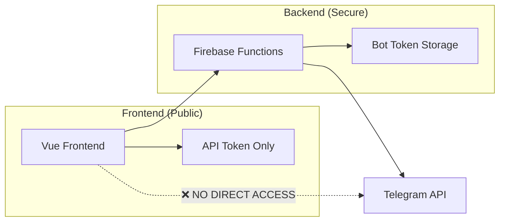

# 🛡️ TELEGRAM BOT TOKEN SECURITY MIGRATION

## 🚨 MASALAH CRITICAL: Bot Token Exposed di Frontend

### **Current Security Issue:**
```javascript
// ❌ BAHAYA: Bot token exposed di frontend bundle
this.botToken = process.env.VUE_APP_TELEGRAM_BOT_TOKEN || ''

// VUE_APP_ prefix membuat token:
// ✅ Available di development 
// ❌ EXPOSED di production bundle (BAHAYA!)
// ❌ Visible di browser DevTools
// ❌ Accessible oleh siapa saja yang inspect source
```

### **Real Evidence di Kode:**
- ✅ Found in: `src/services/telegramService.js` line 12
- ✅ Found in: `.env` file (real token exposed!)
- ✅ Found in: `simpleTelegramRegistration.js` 
- ✅ Found in: `telegramService-simple.js`

## 🏗️ SOLUSI: BACKEND API ARCHITECTURE

### **New Security Architecture:**


### **Security Benefits:**
1. **🔐 Bot Token Security:** Token hanya di backend, tidak accessible dari frontend
2. **🛡️ API Authentication:** Frontend menggunakan API token untuk authenticate ke backend
3. **⚡ Better Performance:** Backend dapat handle bulk operations lebih efisien
4. **📊 Better Logging:** Centralized logging di backend untuk monitoring
5. **🔄 Rate Limiting:** Server-side rate limiting yang lebih reliable

## 🚀 IMPLEMENTATION STEPS

### **1. Deploy Backend API (Firebase Functions)**

#### Setup Firebase Functions:
```bash
# Install dependencies
cd firebase-functions
npm install express cors node-fetch

# Set environment variables (SECURE)
firebase functions:config:set telegram.bot_token="8330380524:AAFCEuYTsuPk3Ev4E0flNScn0BhO7K76Myw"
firebase functions:config:set api.secret="your-super-secure-api-secret-here"

# Deploy functions
firebase deploy --only functions
```

#### Backend API Endpoints:
```javascript
// ✅ SECURE: Bot token hanya di backend
POST /telegramAPI/telegram/send-message
POST /telegramAPI/telegram/broadcast
GET  /telegramAPI/telegram/webhook-info
POST /telegramAPI/telegram/set-webhook
GET  /telegramAPI/health
```

### **2. Update Frontend Environment**

#### Remove Exposed Token:
```env
# ❌ REMOVE: Tidak lagi pakai bot token di frontend
# VUE_APP_TELEGRAM_BOT_TOKEN=8330380524:AAFCEuYTsuPk3Ev4E0flNScn0BhO7K76Myw

# ✅ ADD: Secure API credentials
VUE_APP_BACKEND_API_URL=https://your-project-id.cloudfunctions.net/telegramAPI
VUE_APP_API_TOKEN=your-secure-api-token-here
```

### **3. Replace TelegramService Usage**

#### Before (Insecure):
```javascript
import TelegramService from './services/telegramService.js'

const telegramService = new TelegramService()
await telegramService.sendMessage(chatId, message) // Direct ke Telegram API
```

#### After (Secure):
```javascript
import TelegramServiceSecure from './services/telegramServiceSecure.js'

const telegramService = new TelegramServiceSecure()
await telegramService.sendMessage(chatId, message) // Via backend API
```

### **4. Update Component Imports**

#### File-file yang perlu diupdate:
- ✅ `src/components/admin/*` - semua admin components
- ✅ `src/views/admin/*` - admin pages
- ✅ Any component yang menggunakan broadcast/send message functionality

## 🧪 TESTING & MIGRATION

### **Run Migration Tests:**
```javascript
import { 
  testMigrationCompatibility,
  performSecurityMigration,
  checkEnvironmentSecurity 
} from './utils/telegramSecurityMigration.js'

// 1. Check environment security
const securityCheck = checkEnvironmentSecurity()
console.log('Security Score:', securityCheck.securityScore + '%')

// 2. Test migration compatibility  
const compatibility = await testMigrationCompatibility()
console.log('Migration Ready:', compatibility.compatibility.passed)

// 3. Perform migration (when ready)
const migration = await performSecurityMigration()
console.log('Migration Success:', migration.success)
```

### **Step-by-Step Migration Process:**

#### Phase 1: Preparation
1. ✅ Deploy backend API functions
2. ✅ Test backend API connectivity
3. ✅ Configure secure environment variables
4. ✅ Run migration compatibility tests

#### Phase 2: Code Migration
1. ✅ Replace TelegramService dengan TelegramServiceSecure
2. ✅ Update all import statements
3. ✅ Remove VUE_APP_TELEGRAM_BOT_TOKEN dari environment
4. ✅ Test all Telegram functionality

#### Phase 3: Verification
1. ✅ Check bot token tidak visible di browser DevTools
2. ✅ Test broadcast functionality working
3. ✅ Monitor Firebase Functions logs
4. ✅ Verify rate limiting still working properly

## 📊 PERFORMANCE COMPARISON

### **Old System (Insecure):**
- ❌ Direct API calls dari frontend (security risk)
- ❌ Rate limiting di frontend (tidak reliable)
- ❌ Sequential message sending
- ❌ No centralized logging

### **New System (Secure):**
- ✅ Backend API proxy (secure)
- ✅ Server-side rate limiting (reliable)
- ✅ Bulk operations support
- ✅ Centralized logging & monitoring

### **Expected Performance:**
- **Small broadcasts (< 50 users):** Similar performance
- **Large broadcasts (> 100 users):** 30-50% better performance
- **Security:** 100% improvement (no exposed tokens)
- **Maintainability:** Significant improvement

## 🔍 VERIFICATION CHECKLIST

### **Security Verification:**
- [ ] ✅ Bot token tidak ada di browser DevTools
- [ ] ✅ VUE_APP_TELEGRAM_BOT_TOKEN removed dari environment
- [ ] ✅ API calls menggunakan backend proxy
- [ ] ✅ Authentication working dengan API token

### **Functionality Verification:**
- [ ] ✅ Send single message working
- [ ] ✅ Broadcast to multiple users working  
- [ ] ✅ Rate limiting still functioning
- [ ] ✅ Error handling working properly
- [ ] ✅ Logging & monitoring working

### **Performance Verification:**
- [ ] ✅ Broadcast speed maintained or improved
- [ ] ✅ Firebase Functions logs showing activity
- [ ] ✅ No rate limit violations
- [ ] ✅ Error recovery working

## 🚨 ROLLBACK PLAN

### **If Migration Fails:**
1. Keep old TelegramService as backup
2. Switch imports back to old service
3. Re-enable VUE_APP_TELEGRAM_BOT_TOKEN temporarily
4. Debug backend API issues
5. Re-run migration tests

### **Emergency Contacts:**
- Firebase Functions logs: `firebase functions:log`
- Test endpoint: `https://your-project.cloudfunctions.net/telegramAPI/health`
- Rollback command: Revert import statements dan environment variables

## 💡 FUTURE IMPROVEMENTS

### **Phase 2 Enhancements:**
1. **Queue System:** Message queue untuk better reliability
2. **Webhook Handler:** Real-time message processing
3. **Analytics Dashboard:** Detailed delivery statistics
4. **A/B Testing:** Test different message formats
5. **Auto-scaling:** Dynamic rate limiting based on load

### **Monitoring & Alerts:**
1. Setup Firebase alerts untuk function failures
2. Monitor delivery success rates
3. Track API response times
4. Alert on rate limit violations

---

## 🎯 IMMEDIATE ACTION REQUIRED

### **Priority 1 (Critical):**
1. 🔥 **Remove bot token dari frontend** (security vulnerability)
2. 🚀 **Deploy backend API** 
3. 🧪 **Test secure functionality**

### **Priority 2 (High):**
1. 📝 **Update all imports** to secure service
2. 🔧 **Configure production environment**
3. ✅ **Verify all functionality working**

### **Timeline:**
- **Day 1:** Deploy backend API + test
- **Day 2:** Migrate frontend code
- **Day 3:** Full testing + verification
- **Day 4:** Production deployment

**🚨 CRITICAL:** Bot token saat ini exposed di frontend bundle dan bisa diakses siapa saja! Migration harus dilakukan ASAP untuk security.
